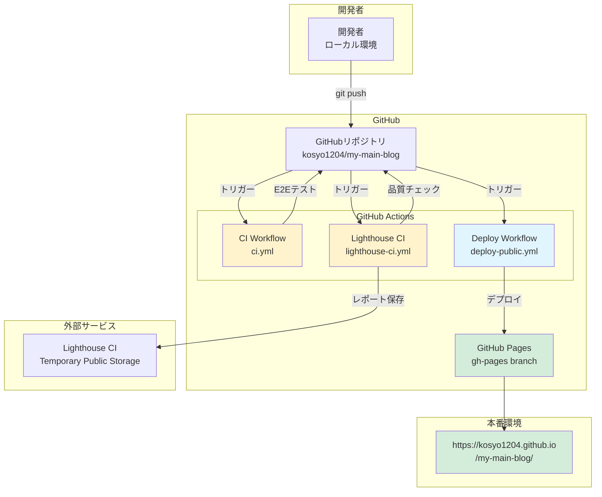
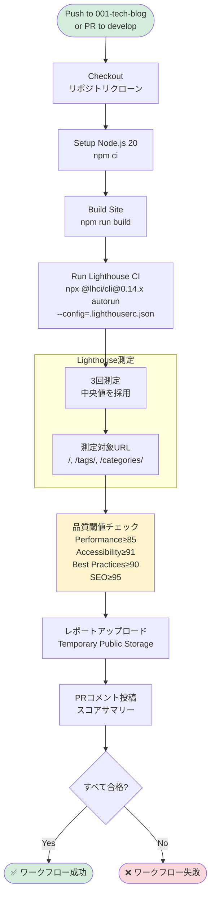
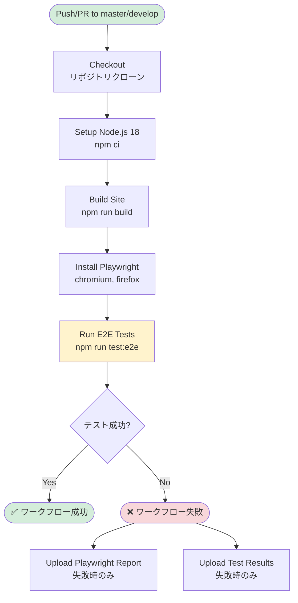
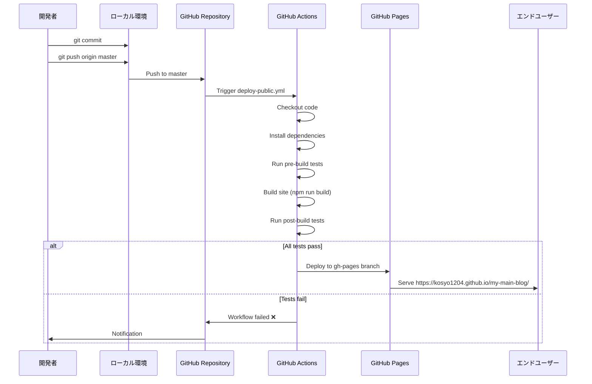
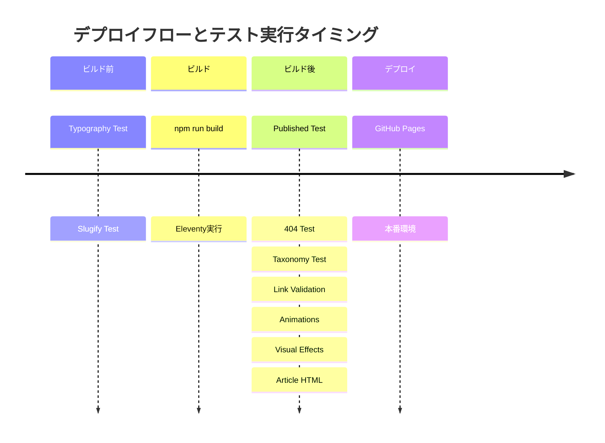

# インフラ構成（CI/CDパイプライン）

このドキュメントでは、my-main-blog のインフラ構成、特に CI/CD パイプラインについて図式化して説明します。

---

## 1. インフラ概要

- **ホスティング**: GitHub Pages
- **CI/CD**: GitHub Actions
- **品質管理**: Lighthouse CI, Playwright, カスタム検証スクリプト
- **コスト**: 完全無料（GitHub無料プラン内）

---

## 2. 全体構成図



---

## 3. CI/CDワークフロー一覧

| ワークフロー | ファイル | トリガー | 目的 |
|------------|---------|---------|------|
| **CI** | `ci.yml` | push/PR (master, develop) | E2Eテスト実行 |
| **Deploy** | `deploy-public.yml` | push/PR (master, develop) | ビルド/検証（master push時のみデプロイ） |
| **Lighthouse CI** | `lighthouse-ci.yml` | push (001-tech-blog), PR (develop, 001-tech-blog) | パフォーマンス品質チェック |

---

## 4. デプロイワークフロー詳細

### 4.1 Deploy Workflow (deploy-public.yml)

```mermaid
flowchart TD
    START([Push/PR to master/develop])
    CHECKOUT[Checkout<br/>リポジトリクローン]
    SETUP[Setup Node.js 20<br/>npm ci]

    TEST_TYPO[Test Typography<br/>タイポグラフィ設定検証]
    TEST_SLUG[Test Slugify<br/>スラッグ生成検証]

    BUILD[Build Site<br/>npm run build]

    TEST_PUB[Test Published<br/>公開記事検証]
    TEST_404[Test 404<br/>404ページ検証]
    TEST_TAX[Test Taxonomy<br/>タグ・カテゴリー検証]
    TEST_LINK[Test Links<br/>内部リンク検証]
    TEST_ANIM[Test Animations<br/>アニメーション検証]
    TEST_VFX[Test Visual Effects<br/>視覚効果検証]
    TEST_HTML[Test Article HTML<br/>記事HTML構造検証]

    DEPLOY{master branch?}
    GH_PAGES[Deploy to GitHub Pages<br/>peaceiris/actions-gh-pages]
    ARCHIVE[Archive Build<br/>PR用アーティファクト保存]

    END([完了])

    START --> CHECKOUT
    CHECKOUT --> SETUP
    SETUP --> TEST_TYPO
    TEST_TYPO --> TEST_SLUG
    TEST_SLUG --> BUILD

    BUILD --> TEST_PUB
    TEST_PUB --> TEST_404
    TEST_404 --> TEST_TAX
    TEST_TAX --> TEST_LINK
    TEST_LINK --> TEST_ANIM
    TEST_ANIM --> TEST_VFX
    TEST_VFX --> TEST_HTML

    TEST_HTML --> DEPLOY
    DEPLOY -->|Yes| GH_PAGES
    DEPLOY -->|No (PR)| ARCHIVE
    GH_PAGES --> END
    ARCHIVE --> END

    style START fill:#d4edda
    style BUILD fill:#fff3cd
    style GH_PAGES fill:#e1f5ff
    style END fill:#d4edda
```

#### 実行テスト一覧

| テスト | npm script | 検証内容 |
|--------|-----------|----------|
| **Typography** | `test:typography` | タイポグラフィ設定の整合性 |
| **Slugify** | `test:slugify` | スラッグ生成ロジックの正確性 |
| **Published** | `test:published` | `published: true` 記事の存在確認 |
| **404** | `test:404` | 404ページの存在と内容 |
| **Taxonomy** | `test:taxonomy` | タグ・カテゴリーページの整合性 |
| **Link Validation** | `test:link-validation` | 内部リンクの `/my-main-blog/` プレフィックス検証 |
| **Animations** | `test:animations` | アニメーション・マイクロインタラクション検証 |
| **Visual Effects** | `test:visual-effects` | シャドウ・背景効果検証 |
| **Article HTML** | `test:article-html` | 記事HTML構造とCSS検証 |

---

## 5. Lighthouse CIワークフロー詳細

### 5.1 Lighthouse CI Workflow (lighthouse-ci.yml)



#### Lighthouse閾値

| カテゴリー | 閾値 | 説明 |
|-----------|------|------|
| **Performance** | ≥ 0.85 (85) | ページ読み込み速度 |
| **Accessibility** | ≥ 0.91 (91) | アクセシビリティ |
| **Best Practices** | ≥ 0.90 (90) | ベストプラクティス |
| **SEO** | ≥ 0.95 (95) | SEO最適化 |

**注意**: Lighthouse CIは閾値未達時にワークフローを失敗させます (`continue-on-error` なし)。

---

## 6. E2Eテストワークフロー詳細

### 6.1 CI Workflow (ci.yml)



#### E2Eテスト内容

Playwright を使用した自動ブラウザテスト:

- ページナビゲーションの動作確認
- モバイルメニュー開閉およびモバイル・デスクトップ表示（レスポンシブ）の確認
- 基本的なキーボード操作（Tab移動、Escキーなど）の確認
- パフォーマンス予算の基本チェック（LCP測定）
- HTML セマンティクス検証（main、nav、header、footer）

---

## 7. ブランチ戦略とCI/CD


### ブランチごとのワークフロー実行

| ブランチ | CI | Deploy | Lighthouse CI |
|---------|----|---------|--------------|
| **master** | ✅ | ✅ デプロイ実行 | - |
| **develop** | ✅ | ✅ ビルドのみ | - |
| **001-tech-blog** | - | - | ✅ |
| **PR → master** | ✅ | ✅ アーティファクト保存 | - |
| **PR → develop** | ✅ | ✅ アーティファクト保存 | ✅ |

---

## 8. デプロイフロー



---

## 9. GitHub Pages設定

### リポジトリ設定

- **Source**: Deploy from a branch
- **Branch**: `gh-pages` / (root)
- **URL**: https://kosyo1204.github.io/my-main-blog/

### GitHub Actions権限

```yaml
permissions:
  contents: write      # コード読み取り・書き込み
  pages: write         # GitHub Pagesデプロイ
  id-token: write      # OIDC認証
```

---

## 10. 検証スクリプト詳細

すべての検証スクリプトは `scripts/` ディレクトリに配置され、Node.jsで実行されます。

### 10.1 スクリプト一覧

| スクリプト | ファイル | 検証内容 |
|-----------|---------|----------|
| **Published** | `validate-published.js` | 公開記事が1件以上存在 |
| **404** | `validate-404.js` | 404ページの存在と必須要素 |
| **Taxonomy** | `validate-taxonomy.js` | タグ・カテゴリーページの整合性 |
| **GA4** | `validate-ga4.js` | Google Analytics 4 タグ設置 |
| **Alt Text** | `validate-alt-text.js` | 画像alt属性の存在 |
| **Internal Links** | `validate-internal-links.js` | `/my-main-blog/` プレフィックス |
| **Animations** | `validate-animations.js` | アニメーション設定 |
| **Typography** | `validate-typography.js` | タイポグラフィ設定 |
| **Slugify** | `validate-slugify.js` | スラッグ生成ロジック |
| **Theme** | `validate-theme.js` | テーマ設定 |
| **Accessibility** | `validate-a11y.js` | アクセシビリティ基本チェック |
| **Visual Effects** | `validate-visual-effects.js` | シャドウ・背景効果 |
| **Article Design** | `validate-article-design.js` | 記事デザイン |
| **Article HTML** | `validate-article-html.js` | DOM構造とCSS検証 (jsdom使用) |

### 10.2 テスト実行タイミング



---

## 11. 環境変数とシークレット

### GitHub Actions環境変数

ワークフロー内で使用される環境変数:

| 環境変数 | 用途 | 設定元 |
|---------|------|--------|
| `LHCI_GITHUB_TOKEN` | Lighthouse CI の GitHub統合（PRコメント投稿） | `${{ secrets.GITHUB_TOKEN }}` (自動生成) |
| `GITHUB_TOKEN` | GitHub API アクセス、デプロイ | `${{ secrets.GITHUB_TOKEN }}` (自動生成) |

**注意**: すべてGitHub Actionsが自動生成するトークンを使用。カスタムシークレットは不要。

---

## 12. コスト構造

| サービス | プラン | コスト |
|---------|-------|--------|
| GitHub Pages | 無料 | $0 |
| GitHub Actions | 無料枠 (2,000分/月) | $0 |
| Lighthouse CI Storage | Temporary Public Storage | $0 |

**合計**: **$0/月** （GitHub無料プラン内）

---

## 13. パフォーマンス監視

### 監視項目

1. **Lighthouse CI スコア** (自動)
   - Performance, Accessibility, Best Practices, SEO

2. **Core Web Vitals** (手動)
   - LCP (Largest Contentful Paint)
   - INP (Interaction to Next Paint)
   - CLS (Cumulative Layout Shift)

3. **ビルド時間** (GitHub Actions)
   - 平均ビルド時間: ~2-3分

4. **バンドルサイズ** (手動)
   - gzip圧縮後のサイズ測定

### アラート

- Lighthouse CI が閾値未達の場合、ワークフローが失敗
- 開発者に GitHub 通知が送信される

---

## 14. トラブルシューティング

### よくある問題

| 問題 | 原因 | 解決方法 |
|------|------|---------|
| デプロイ失敗 | テスト失敗 | ローカルで `npm run test:*` を実行して問題を特定 |
| Lighthouse CI失敗 | スコア低下 | パフォーマンス予算ドキュメント参照 |
| E2E テスト失敗 | Playwright エラー | `playwright-report` アーティファクトを確認 |
| 404 ページ表示 | 内部リンクエラー | `/my-main-blog/` プレフィックス確認 |

### ログ確認

1. **GitHub Actions**
   - リポジトリ → Actions → 該当ワークフロー → ログ確認

2. **Lighthouse CI**
   - PR コメントのスコア確認
   - Temporary Public Storage のレポート確認

---

## 関連ドキュメント

- [システム構成（アーキテクチャ）](./SYSTEM_ARCHITECTURE.md)
- [パフォーマンス予算](../performance-budget.md)
- [Git運用ガイド](../git-workflow/README.md)
- [要件定義](../requirements/REQUIREMENTS.md)

---

## 更新履歴

| 日付 | 変更内容 |
|------|----------|
| 2026-03-03 | 初版作成 |
