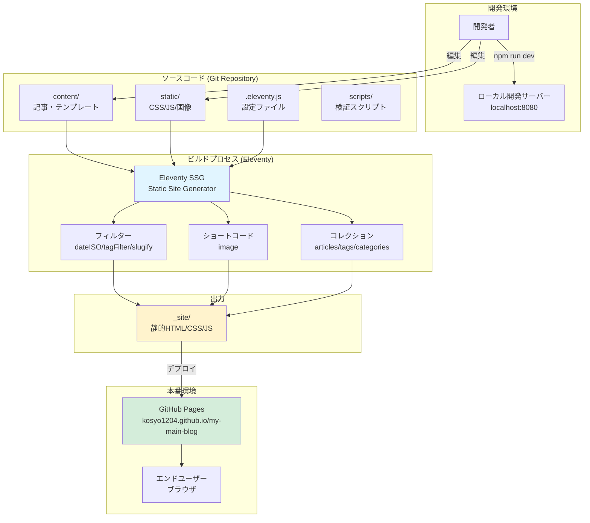
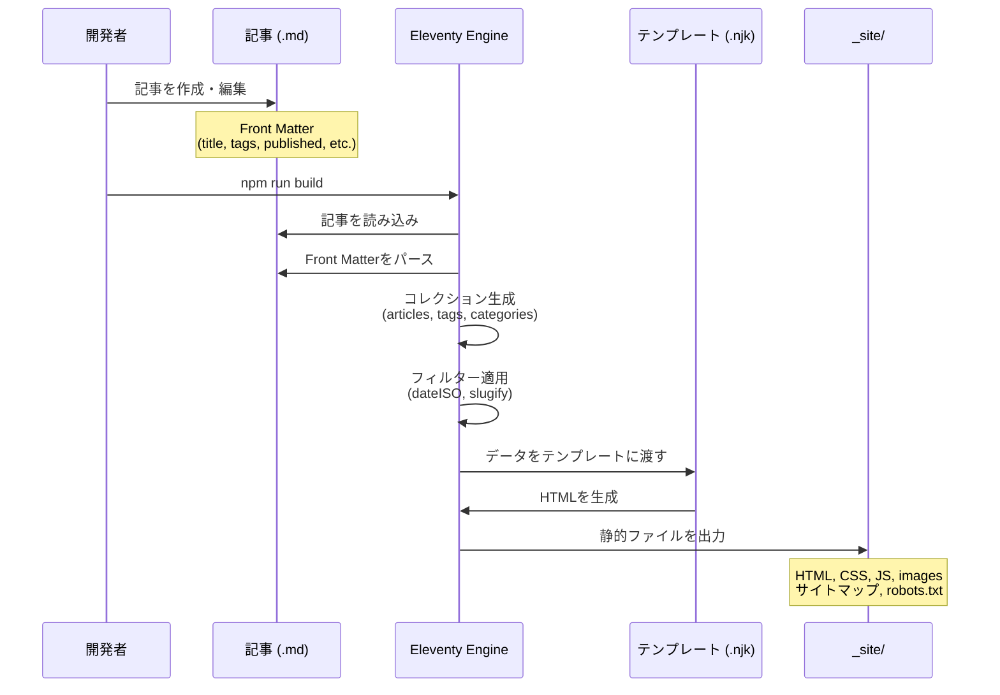
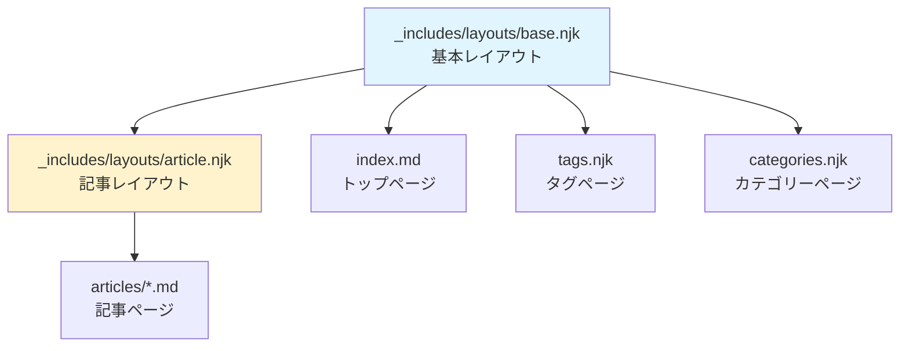

# システム構成

このドキュメントでは、my-main-blog のシステム全体の構成を図式化して説明します。

---

## 1. システム概要

my-main-blog は以下の技術スタックで構成される静的サイトジェネレータベースのブログシステムです。

- **静的サイトジェネレータ**: Eleventy (11ty) v2.0
- **テンプレートエンジン**: Nunjucks (.njk)
- **デプロイ先**: GitHub Pages
- **CI/CD**: GitHub Actions
- **品質管理**: Lighthouse CI, Playwright, カスタム検証スクリプト

---

## 2. システムアーキテクチャ図



---

## 3. ディレクトリ構造

```
my-main-blog/
├── content/              # コンテンツソース
│   ├── articles/        # 記事 (.md)
│   ├── _includes/       # テンプレート (.njk)
│   ├── _data/           # グローバルデータ (.json)
│   ├── tags/            # タグページ
│   ├── categories/      # カテゴリーページ
│   ├── index.md         # トップページ
│   ├── 404.md           # 404ページ
│   ├── sitemap.njk      # サイトマップ
│   └── robots.njk       # robots.txt
│
├── static/              # 静的アセット
│   ├── css/            # スタイルシート
│   └── js/             # JavaScript
│
├── _site/               # ビルド出力（Git管理外）
│
├── scripts/             # 検証スクリプト
│   ├── validate-published.js
│   ├── validate-404.js
│   ├── validate-taxonomy.js
│   ├── validate-internal-links.js
│   ├── validate-animations.js
│   ├── validate-typography.js
│   ├── validate-article-html.js
│   └── ... (その他)
│
├── tests/               # E2Eテスト (Playwright)
│   └── *.spec.js       # Playwright テスト
│
├── .github/
│   └── workflows/       # CI/CDワークフロー
│       ├── deploy-public.yml
│       ├── lighthouse-ci.yml
│       └── ci.yml
│
├── docs/                # プロジェクトドキュメント
├── specs/               # 仕様書
├── .eleventy.js         # Eleventy設定
├── .lighthouserc.json   # Lighthouse CI設定
├── package.json         # npm設定
└── playwright.config.js # Playwright設定
```

---

## 4. データフロー



---

## 5. 主要コンポーネント

### 5.1 Eleventy設定 (.eleventy.js)

| 機能 | 説明 |
|------|------|
| **パススルーコピー** | `static/` → `/` へ静的ファイルをコピー |
| **フィルター** | `dateISO`, `tagFilter`, `slugify`, `date` など |
| **ショートコード** | `image` 画像最適化コンポーネント |
| **コレクション** | 記事を日付順でソート、タグ・カテゴリーを収集 |
| **パスプレフィックス** | `/my-main-blog/` を全URLに付与 |

### 5.2 Front Matter (記事メタデータ)

各記事ファイル (.md) のYAML Front Matter:

```yaml
---
title: "記事タイトル"
publishedAt: "2026-02-14"
tags: ["JavaScript", "React"]
category: "frontend"
published: true
description: "記事の概要"
---
```

### 5.3 コレクション

Eleventyが自動生成するコレクション:

- `collections.articles` - すべての記事（日付順ソート）
- `collections.tags` - すべてのタグ
- `collections.categories` - すべてのカテゴリー

---

## 6. テンプレート階層



---

## 7. URL構造

GitHub Pages デプロイ時の URL 構造:

```
https://kosyo1204.github.io/my-main-blog/
├── /                           # トップページ (index.html)
├── /articles/
│   └── /記事スラッグ/           # 個別記事ページ
├── /tags/
│   ├── /                       # タグ一覧
│   └── /タグ名/                # タグ別記事一覧
├── /categories/
│   ├── /                       # カテゴリー一覧
│   └── /カテゴリー名/           # カテゴリー別記事一覧
├── /404.html                   # 404エラーページ
├── /sitemap.xml                # サイトマップ
└── /robots.txt                 # robots.txt
```

**重要**: すべての内部リンクは `/my-main-blog/` プレフィックスを含む必要があります。

---

## 8. ビルドプロセス

```mermaid
flowchart LR
    START([npm run build])
    READ[コンテンツ読み込み<br/>content/**/*.md]
    PARSE[Front Matterパース<br/>メタデータ抽出]
    FILTER[フィルター適用<br/>published: true]
    COLLECTION[コレクション生成<br/>articles/tags/categories]
    TEMPLATE[テンプレート適用<br/>.njk → HTML]
    COPY[静的ファイルコピー<br/>static/ → /]
    OUTPUT[_site/ 出力]
    END([完了])

    START --> READ
    READ --> PARSE
    PARSE --> FILTER
    FILTER --> COLLECTION
    COLLECTION --> TEMPLATE
    TEMPLATE --> COPY
    COPY --> OUTPUT
    OUTPUT --> END

    style START fill:#d4edda
    style END fill:#d4edda
    style OUTPUT fill:#fff3cd
```



---

## 9. 設定ファイル

| ファイル | 用途 |
|---------|------|
| `.eleventy.js` | Eleventy の設定（パス、フィルター、コレクション） |
| `package.json` | npm スクリプト、依存関係 |
| `.lighthouserc.json` | Lighthouse CI の品質閾値 |
| `playwright.config.js` | E2E テストの設定 |
| `.gitignore` | Git 管理対象外ファイル |

---

## 10. パフォーマンス最適化

### 10.1 画像最適化

Eleventy Image プラグイン (`@11ty/eleventy-img`) を使用:

- 自動的に複数サイズ生成
- WebP形式への変換
- レスポンシブ画像の生成

### 10.2 バンドルサイズ

- CSS/JSの最小化は手動管理
- gzip圧縮後のサイズを監視

### 10.3 Core Web Vitals

目標値:
- **LCP** (Largest Contentful Paint): ≤ 2.5秒
- **INP** (Interaction to Next Paint): ≤ 200ミリ秒
- **CLS** (Cumulative Layout Shift): ≤ 0.1

---

## 関連ドキュメント

- [インフラ構成（CI/CDパイプライン）](./INFRASTRUCTURE.md)
- [パフォーマンス予算](../performance-budget.md)
- [Git運用ガイド](../git-workflow/README.md)
- [要件定義](../requirements/REQUIREMENTS.md)

---

## 更新履歴

| 日付 | 変更内容 |
|------|----------|
| 2026-03-03 | 初版作成 |
